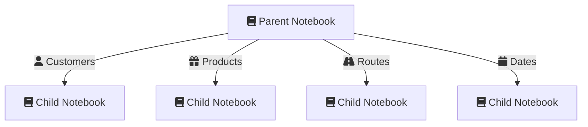

---
title: Approaches for using SQL in dynamic synapse spark notebooks
tags:
  - spark
  - synapse
  - Azure
  - notebook
date: 2024-04-06
---

3 Approaches.

1. Inline (non dynamic)
2. Config DB (Awful UX for developers)
3. Permanent Notebook Views

Introduction to the concept
## High Level

> [!tip]- Key Concept - Parent - Child notebooks
> The Parent-Child design pattern in notebooks, commonly used in data engineering and analysis workflows, involves structuring multiple notebooks where a 'parent' notebook orchestrates the flow and execution of 'child' notebooks. This hierarchical approach allows for modular, reusable code, enabling separation of concerns and making the overall workflow more manageable and scalable. The child notebooks typically perform specific tasks or analyses and can be independently developed and tested. This pattern also facilitates parallel execution and easier debugging, as each child notebook can be run in isolation or in combination as dictated by the parent notebook.

This is the invocation view. The child notebooks are note different notebooks, simply numerous executions of the same notebook.

A lot of the detail can be hidden away in variables that can be defined at runtime. 

This includes heavy customization that is typically hidden away in Spark SQL.

Now lets look at the options.

#### Inline

#### Config Database

#### Permanent Notebook for Views.